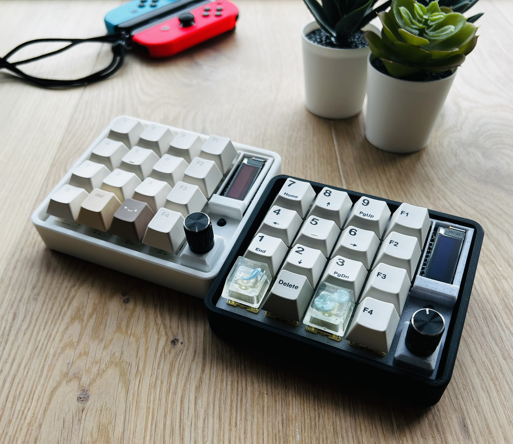
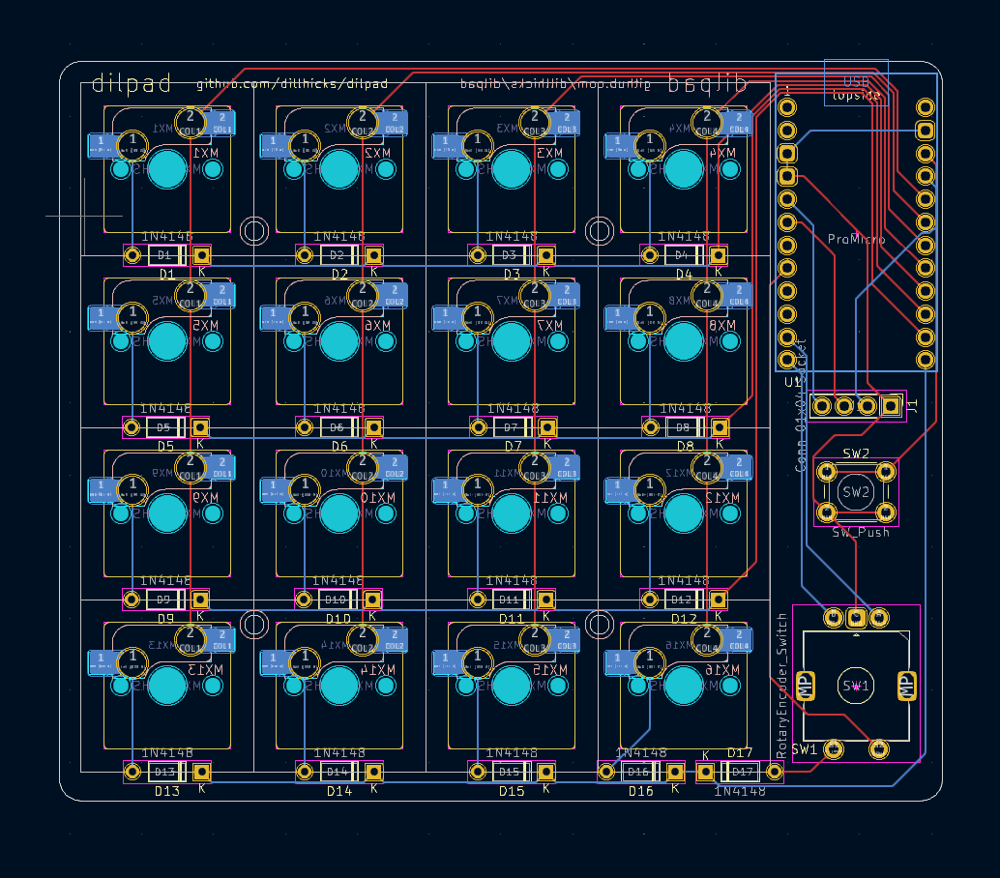
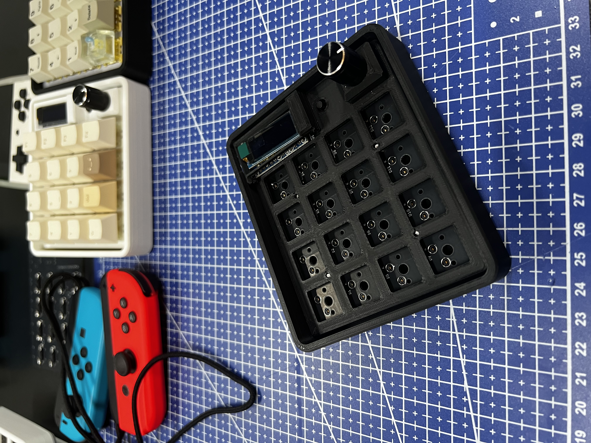

# dilpad: Hotswap Numpad/Macropad with QMK Support

## Summary

**Dilpad** is a simple, easy to build numpad that is loosely based on the [Dumbpad](https://github.com/imchipwood/dumbpad). Initially created as a fork of the [Dumbpad combo_oled](https://github.com/imchipwood/dumbpad/tree/master/combo_oled), but adds hotswap switches, screw holes for mounting the PCB to the case, and moved everything to the right. It was decided at that point to simply make another board to learn how to build keyboards from scratch!

This board presents a great introduction to making keyboards, and soldering to those who are new. The dilpad also sounds surprisingly good with a plate/shroud and case that resonates well. The dilpad was also designed with a little bit more space to the edges of the PCB, which can open the doors for some interesting mounting options, such as gasket mounting if anyone wants to try that.

## Features

* **QMK & VIA Support**
  
* **Hotswap Sockets**

* **Rotary Encoder**
  
* **Through-Hole Components: Designed for straightforward soldering.**

## Parts List

The following components are needed to build the dilpad. Costs have been added for convenience (based off of 2024 Aliexpress prices)

### Mandatory Components

| Component      | Quantity | Approx. Cost for 1 dilpad ($) |
| ----------- | ----------- |-----|
| Dilpad PCB      | 1       | 2.5 |
| MX-style mechanical switches   | 16 | 4 |
| Kailh CPG151101S11 hotswap sockets   | 16 | 3 |
| MX-style keycaps   | 16 | 2.5 (or use those leftover with your keycap set!) |
| 1N4148 diodes (through-hole)  | 17 | 0.5 |
| Arduino Pro Micro or a pin-compatible ATmega32u4-based MCU | 1 | 3.5 |

### Optional Components

| Component      | Quantity | Approx. Cost for 1 dilpad ($) |
| ----------- | ----------- |-----|
| EC11 rotary encoder with pushbutton   | 1 | 1 |
| SSD1306 OLED | 1 | 2 |
| 6mm push button  | 1 | .25 |

In total, it should cost less than 25 dollars, even cheaper if you decide to forgo the OLED and rotary encoder!

### Tools Needed
* Soldering Iron

* Flush Wire Cutters

* Kapton Tape (to insulate the bottom of the OLED)

## Assembly Instructions

I reccomend to solder the components in the following order to the starting from the back side of the PCB:

1. Hotswap Sockets (insert on the back, soldered from the back)
2. Diodes (insert on the front, solder from the back, then cut off diode leads)
3. Arduino Pro Micro (insert on the front, solder from the back, then cut off leads)
4. Rotary Encoder (insert on the front, solder from the back)
5. OLED (Insert on the front, elevate over the Pro Micro, then solder from the back)

Flash Your Firmware:

1. Download the .hex file included in the firmware folder, I reccomend the dilpad_via.hex file.
2. Install QMK Toolbox, or another .hex flashing tool such as avrdude
3. Turn on Auto-Flash in QMK Toolbox, or find what COM Port is used when the Pro Micro is reset in the next step
4. Reset the Pro Micro by shorting GND and RESET, or if the 6mm button is installed, press the button
5. QMK Toolbox should the flash the firmware, or start avrdude immediately after resetting, the firmware should then flash, and should be ready to go!

## Case and Plate

Below are links for the plate/shroud and the two case variants

